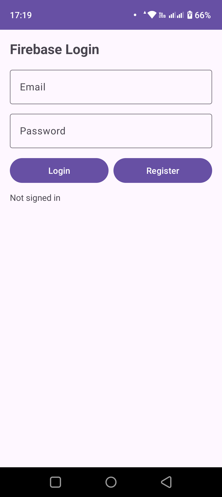
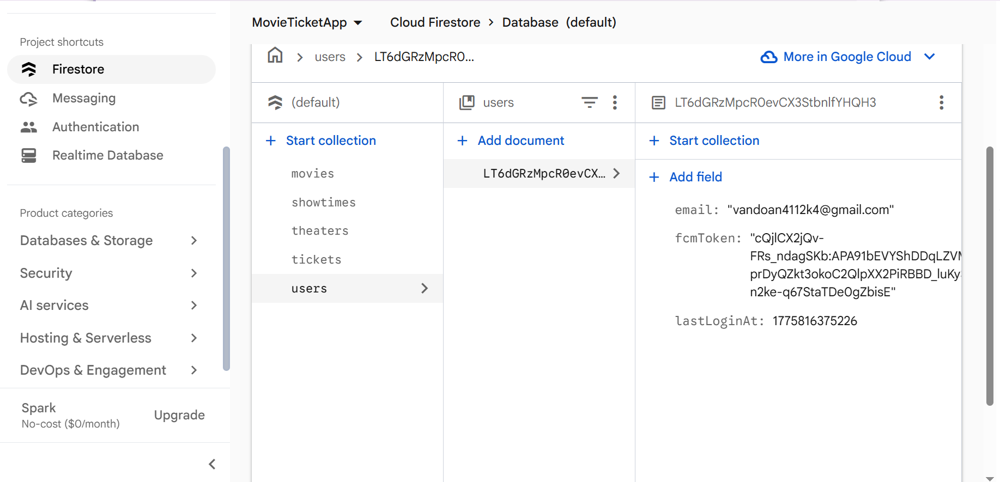
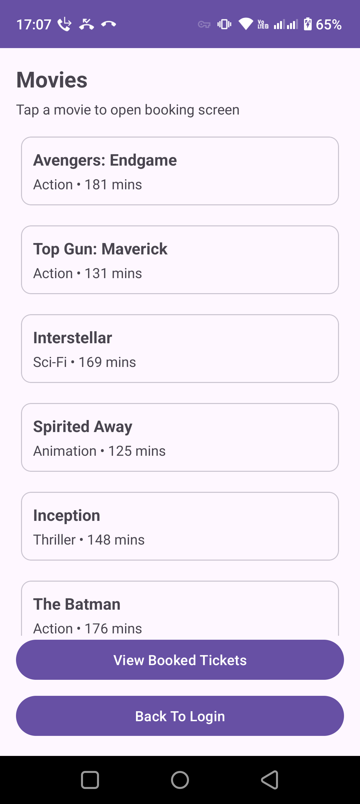
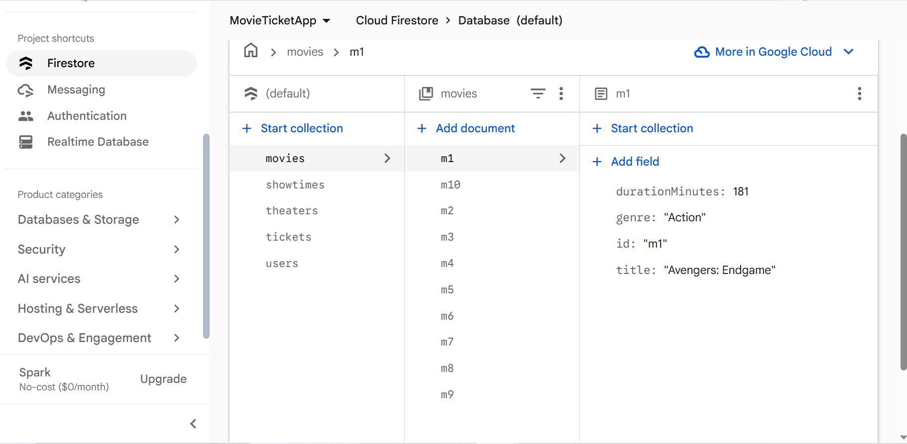
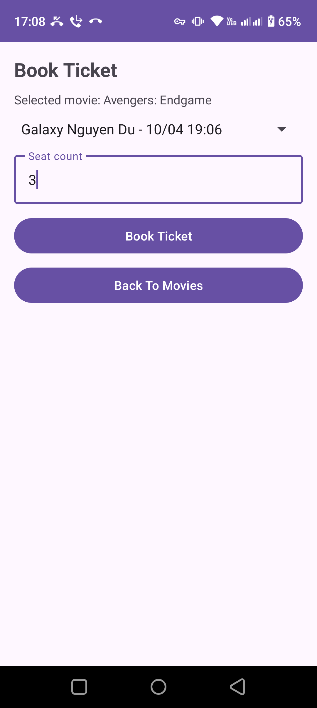
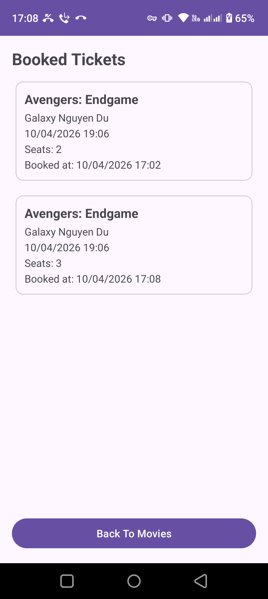
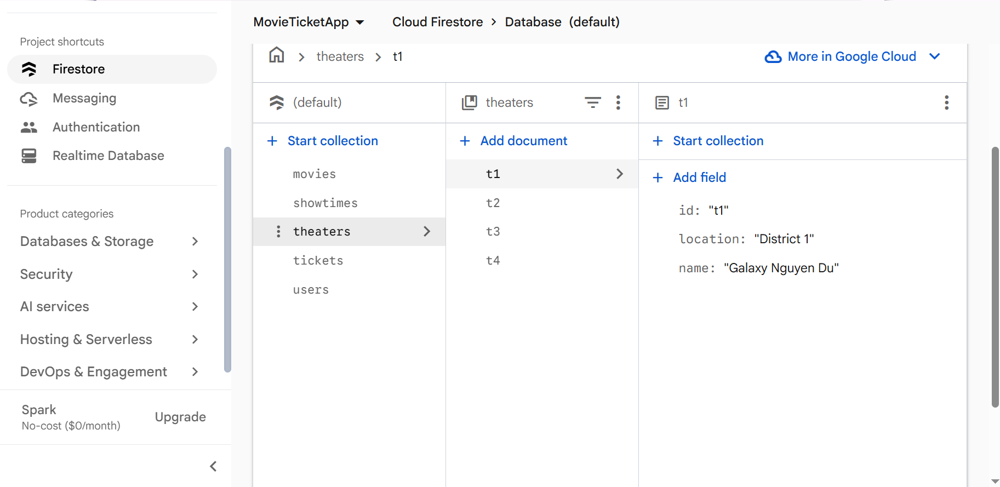
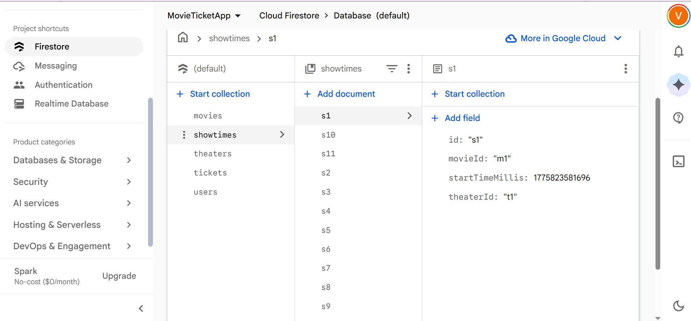
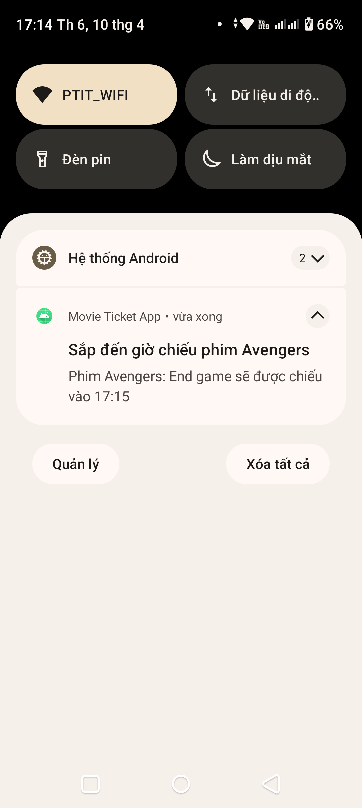
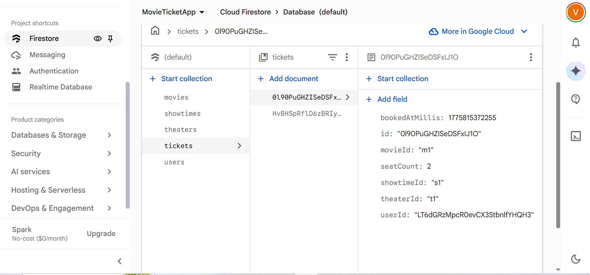

# Movie Ticket App

Ứng dụng Android Java dùng Firebase cho đăng nhập, xem phim, đặt vé, lưu vé và nhắc giờ chiếu.

## Screenshots

### Login

### Users Collection

### Movie List

### Movies Collection

### Book Ticket

### Ticket Booked

### Theaters Collection

### Showtimes Collection

### Notification

### Tickets Book

## Firebase Features

- Authentication: đăng nhập/đăng ký bằng Firebase Auth
- Firestore: lưu `users`, `movies`, `theaters`, `showtimes`, `tickets`
- Notification: nhắc giờ chiếu bằng notification local và FCM service

## Assets

Các ảnh trong thư mục `assets/` được dùng để minh họa các màn chính của app.
